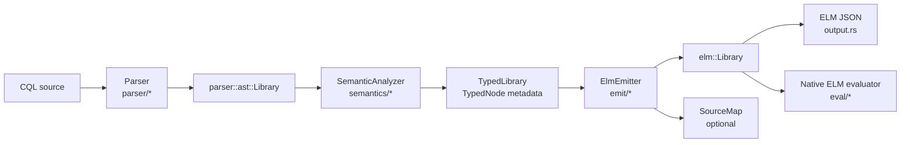

# rh-cql Architecture

`rh-cql` is the CQL engine crate in `rh`. It parses Clinical Quality Language
(CQL), resolves it against model information, emits HL7 Expression Logical Model
(ELM), and provides a native ELM evaluator for local execution and conformance
work.

The stable center of the crate is the CQL-to-ELM engine. Experimental analytics
and SQL-on-FHIR artifact generation live at the bottom of this document because
they are downstream consumers of ELM, not the core execution architecture.

## Responsibilities

`rh-cql` owns these boundaries:

- CQL parsing into a syntax-preserving parser AST.
- Semantic analysis into a typed AST with resolved symbols, scopes, types,
  operators, conversions, retrieves, and diagnostics.
- ELM emission into serializable HL7 ELM Rust structs and JSON.
- Optional CQL-to-ELM source maps.
- Native ELM evaluation for local execution, test fixtures, debugging, and
  conformance comparison.
- Inspectable helper artifacts derived from ELM.

The crate does not own a production analytics runtime. Production execution over
large FHIR stores, warehouses, lakehouses, DataFusion, Spark, DuckDB, Trino,
Postgres, or managed terminology services is an environment-specific concern.

## Engine Overview

The main engine is intentionally staged:



The important architecture choice is that CQL is not translated directly from
parser nodes to JSON. The typed AST is an explicit middle layer. That keeps
syntax parsing, semantic resolution, ELM shape, and runtime evaluation separate
enough to test and evolve independently.

## Compiler Pipeline

All public compile entry points in `compiler.rs` delegate to the shared internal
pipeline. The pipeline can stop after validation, emit ELM, or emit ELM plus a
source map.

### 1. Parse CQL

The parser is a hand-written `nom` parser under `parser/`.

Input:

- CQL source text.

Output:

- `parser::ast::Library`.

The parser AST preserves source-level CQL structure: library headers, usings,
includes, declarations, expressions, retrieves, queries, terminology references,
and source spans. It does not resolve model members or operator overloads.

### 2. Analyze Semantics

Semantic analysis lives under `semantics/` with supporting type and operator
logic in `datatype.rs`, `types.rs`, `operators.rs`, `conversion.rs`, and
`modelinfo.rs`.

Input:

- `parser::ast::Library`.
- `CompilationContext`.
- `CompilerOptions`.
- A `ModelInfoProvider`.

Output:

- `TypedLibrary`.
- Diagnostics.

This stage resolves:

- library and definition scopes;
- expression references, function references, parameters, codes, value sets,
  and code systems;
- model types, members, choice types, and retrieve data types;
- CQL operator overloads and result types;
- implicit conversions allowed by the selected options;
- source spans and node ids carried on `TypedNode<T>`.

The default model boundary is FHIR R4, but callers can supply a different
`ModelInfoProvider` through `CompilationContext` or `compile_with_model`. The
parser does not contain FHIR-specific knowledge.

### 3. Emit ELM

ELM emission lives under `emit/`.

Input:

- `TypedLibrary`.

Output:

- `elm::Library`.
- Optional `SourceMap`.

The emitter converts typed CQL constructs into ELM structs. Because overloads,
types, scopes, and retrieve metadata are already resolved, emission is mostly a
structural lowering step rather than a second semantic pass.

`output.rs` serializes the ELM model to JSON. The JSON boundary is used by the
CLI, tests, downstream tools, and interop checks against other CQL engines.

### 4. Validate, Explain, and Serialize

The same staged pipeline supports multiple public surfaces:

- `compile`, `compile_with_model`, `compile_with_libraries`, and
  `compile_to_json`.
- `validate` for syntax and semantic checks without ELM output.
- `explain_parse` and `explain_compile` for human-readable diagnostics.
- `compile_to_elm_with_sourcemap` for CQL source to ELM source maps.

The CLI exposes the same surfaces through `rh cql compile`, `rh cql validate`,
`rh cql info`, `rh cql explain`, and related subcommands. Use global
`--format json` when command output is consumed by tools.

## CQL Model

CQL authoring concepts enter the engine through the parser and semantic layers.
The compiler treats a CQL library as the compilation unit.

Key CQL constructs:

- Library metadata: `library`, `using`, `include`, `context`.
- Declarations: parameters, value sets, code systems, codes, concepts,
  expressions, and functions.
- Expressions: literals, operators, calls, references, conditionals, intervals,
  lists, tuples, queries, retrieves, and type operations.
- Clinical data access: retrieves such as `[Condition: "Diabetes"]`, resolved
  against model information and terminology references.

The parser records the shape. Semantic analysis decides what names mean, what
types expressions produce, and what ELM operation should represent each
construct.

## ELM Model

The `elm.rs` and `elm/` modules define the serializable ELM object model used by
the compiler and evaluator.

ELM is the engine's durable semantic artifact:

- It is independent of the CQL parser AST.
- It can be serialized to and parsed from JSON.
- It can be evaluated by `eval/`.
- It can be inspected by analytics helper code.
- It is the fixture and interop boundary for comparison with other CQL tooling.

The compiler may include annotations, locators, result type names, and source
map correlation depending on options. Those are side channels over the same ELM
library structure; they should not be required for semantic execution.

## Native ELM Evaluation

The `eval/` module executes ELM directly. It is used for local execution,
compiler development, conformance fixtures, debugging, and artifact comparison.

Major pieces:

- Runtime values for CQL primitives, intervals, lists, tuples, quantities, and
  model-backed data.
- `EvalContext` and builder APIs for clock, parameters, data providers,
  terminology providers, and included libraries.
- Operator implementations split by domain: arithmetic, comparison, logic,
  strings, temporal values, conversions, intervals, lists, queries, and
  clinical/model access.
- Retrieve and query evaluation over provider-supplied data.
- Trace-enabled evaluation through `evaluate_elm_with_trace`.

The evaluator consumes ELM, not parser AST:

```text
CQL source -> parser AST -> typed AST -> ELM library -> eval::evaluate_elm
```

That boundary keeps runtime behavior aligned with the serialized artifact that
other tools also consume.

## Library and Dependency Handling

The `library/` module provides source providers and compiled library management
for includes. Compilation and evaluation both need a stable way to resolve
library identifiers and versions without binding the parser to filesystem or
package layout assumptions.

Includes are resolved into compiled libraries before dependent expressions are
used. Public APIs such as `compile_with_libraries` and
`evaluate_elm_with_libraries` expose this boundary explicitly.

## Diagnostics

Diagnostics flow through `reporting.rs` and are collected where possible rather
than stopping at the first recoverable issue.

Important diagnostic boundaries:

- parser errors from `parser/`;
- semantic, type, conversion, and operator errors from `semantics/`, `types.rs`,
  `conversion.rs`, and `operators.rs`;
- ELM/source-map serialization errors from output surfaces;
- evaluator errors from `eval/`;
- experimental lowering diagnostics from analytics helpers.

CLI JSON output wraps diagnostics in the standard `rh` envelope, which makes the
commands suitable for scripting and agent workflows.

## Module Map

```text
src/
|-- analytics.rs          # Experimental inspection/planning/artifact helpers
|-- compiler.rs           # Public compiler API and shared pipeline
|-- conversion.rs         # FHIRHelpers-style conversion lookup/wrapping
|-- datatype.rs           # Internal semantic type model
|-- elm.rs, elm/          # ELM structs and serialization model
|-- emit/                 # Typed AST -> ELM emission
|-- eval/                 # Native ELM evaluator
|-- explain/              # Explain helpers
|-- library/              # Source providers and compiled library handling
|-- modelinfo.rs          # ModelInfo model
|-- modelinfo_xml/        # ModelInfo XML loading helpers
|-- operators.rs          # Semantic operator resolution
|-- options.rs            # Compiler options
|-- output.rs             # ELM JSON output
|-- parser/               # CQL parser and parser AST
|-- preprocessor.rs       # Library info extraction
|-- provider.rs           # ModelInfo providers
|-- reporting.rs          # Diagnostics
|-- semantics/            # Semantic analyzer, scopes, typed AST
|-- sourcemap.rs          # CQL source to ELM source maps
|-- types.rs              # Type resolution helpers
`-- wasm.rs               # WASM-specific entry points
```

## Extension Points

### Adding CQL Language Support

1. Add syntax and AST shape in `parser/`.
2. Add semantic resolution, typing, and diagnostics in `semantics/`, `types.rs`,
   `operators.rs`, or `conversion.rs`.
3. Add ELM emission in `emit/`.
4. Add native evaluator support in `eval/` when the construct should execute
   locally.
5. Add conformance or golden fixture coverage.

### Adding Model Support

Model-specific knowledge should enter through `ModelInfoProvider` and model
metadata, not through parser rules. New model work usually belongs in
`modelinfo.rs`, `modelinfo_xml/`, `provider.rs`, and semantic type/member
resolution.

### Adding Evaluator Support

Evaluator work should consume ELM nodes and runtime values. Avoid reaching back
into parser AST or source text. When a feature needs external data, add or
extend provider traits instead of embedding storage assumptions into operator
code.

## Experimental SQL-on-FHIR Support

The SQL-on-FHIR path is experimental. It is a downstream artifact and planning
layer over ELM, not the core CQL execution engine.

Current goals:

- inspect compiled ELM;
- extract data requirements;
- build an inspectable relational plan;
- report what can and cannot lower;
- emit deterministic SQL-on-FHIR ViewDefinition artifacts;
- emit SQLQuery `Library` artifacts or raw SQL for backend experiments;
- emit a runtime manifest that references generated artifacts.

Current CLI path:

```bash
rh cql elm inspect measure.elm.json
rh cql elm deps measure.elm.json
rh cql data-requirements measure.cql --format json
rh cql plan measure.cql --target relational --display-format pretty
rh cql lower-check measure.cql --target sql-on-fhir
rh cql emit-views measure.cql --out views/
rh cql emit-sql measure.cql --views views/ --out query-library.json
rh cql emit-runtime measure.cql --views views/ --query query-library.json --out measure-runtime.json
```

### Analytics Helper Layer

`analytics.rs` provides JSON-serializable helper artifacts:

- `ElmInspection` for library identity, usings, includes, parameters,
  terminology declarations, definitions, retrieves, node counts, and dependency
  information.
- `DataRequirements` for resources, retrieves, value sets, code systems, and
  parameters required by a library.
- `RelationalPlan` for the experimental CQL/ELM-to-relational boundary.
- `LowerCheckReport` for supported and unsupported ELM node kinds.
- `ViewDefinitionArtifact`, SQLQuery Library output, SQL text, and runtime
  manifest output.

These artifacts are intended to be reviewed in git, tested as fixtures, and
consumed by external runtimes without linking to compiler internals.

### Experimental Relational Algebra

The relational plan is the experimental IR between ELM and SQL-on-FHIR-oriented
artifacts:

```text
ELM library
  -> data requirements
  -> relational plan
  -> lowerability report
  -> ViewDefinition artifacts
  -> SQLQuery Library / SQL text
  -> runtime manifest
```

The serialized `RelNode` shape is deliberately simple while the lowerer matures:

```json
{
  "op": "Filter",
  "detail": {},
  "inputs": [
    { "op": "Scan", "detail": { "resource": "Condition" } },
    { "op": "Expr", "detail": { "kind": "Equal" } }
  ]
}
```

The current algebra uses conventional relational operators and extends them
with CQL/FHIR-specific metadata:

| Node or extension | Relation to relational algebra | Current purpose |
|---|---|---|
| `Scan` | Base relation | Reads a logical FHIR resource/table, usually derived from an ELM retrieve. |
| `Filter` | Selection | Keeps rows matching a CQL predicate. |
| `Project` | Projection | Shapes output columns or scalar expressions. |
| `SemiJoin` | Semijoin | Represents CQL `with`, usually lowered as `EXISTS`. |
| `AntiJoin` | Antijoin | Represents CQL `without`, usually lowered as `NOT EXISTS`. |
| `Aggregate` | Grouping/aggregation | Represents grouped population or aggregate computations. |
| `Exists` | Existential quantification over a relation | Produces a boolean existence result from an input relation. |
| `Expr.kind` | CQL expression extension | Holds predicate/scalar expression kinds before they have a richer typed relational representation. |
| `Scan.detail.dataType` | FHIR/CQL metadata extension | Preserves the ELM model type such as `{http://hl7.org/fhir}Condition`. |
| `Scan.detail.resource` | FHIR/CQL metadata extension | Normalizes model types to resource/table names such as `Condition`. |
| `SemiJoin.detail.relationship` | CQL query extension | Preserves the source relationship intent for `with`. |
| `AntiJoin.detail.relationship` | CQL query extension | Preserves the source relationship intent for `without`. |
| `Unsupported.detail.elmType` | Lowering diagnostic extension | Makes unsupported ELM shapes explicit and testable. |
| `target` | Planning metadata extension | Names the backend vocabulary being inspected, such as `relational` or `sql-on-fhir`. |

Currently recognized expression kinds include boolean, comparison, terminology,
timing, property, literal, and reference forms:

```text
And, Or, Not,
Equal, NotEqual, Less, LessOrEqual, Greater, GreaterOrEqual,
InValueSet, AnyInValueSet,
Overlaps, IncludedIn, Includes,
Before, After, SameOrBefore, SameOrAfter,
Property, Literal,
ValueSetRef, CodeRef, ExpressionRef, ParameterRef, AliasRef
```

These are placeholders for an evolving typed predicate model. They make the
lowering boundary visible without pretending the first-pass IR captures all CQL
semantics.

### ViewDefinition, SQLQuery, and Runtime Manifest Output

`emit_view_definitions` derives deterministic SQL-on-FHIR ViewDefinition
artifacts from retrieve requirements. Each resource gets stable columns used by
the current analytics fixtures, including `id`, `patient_id`, selected scalar
paths, and code coding expansions when needed.

`emit_sql_text` and `emit_sql_query_library` generate raw SQL text or a FHIR
`Library` containing SQLQuery metadata and dependencies on emitted views.

`emit_measure_runtime_manifest` writes a JSON manifest that references the query
and views rather than embedding compiler internals. Runtime consumers can load
the manifest, bind parameters, execute the selected backend, and collect named
result columns.

### Experimental Limits

The current SQL-on-FHIR support is retrieve-oriented and incomplete. Known gaps
include:

- complete CQL query semantics;
- terminology expansion and value-set membership semantics;
- interval precision rules;
- quantity and UCUM normalization;
- complex list semantics;
- query optimization;
- backend-specific planning;
- full measure population extraction.

These limits should be surfaced through `lower_check` and `Unsupported` plan
nodes. New artifact targets should consume ELM, data requirements, or the
relational plan rather than re-walking CQL source directly.
