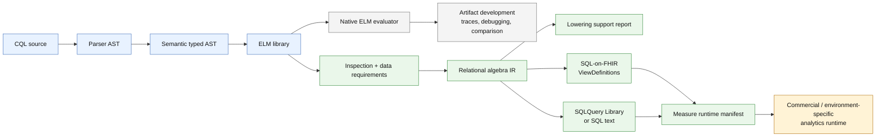
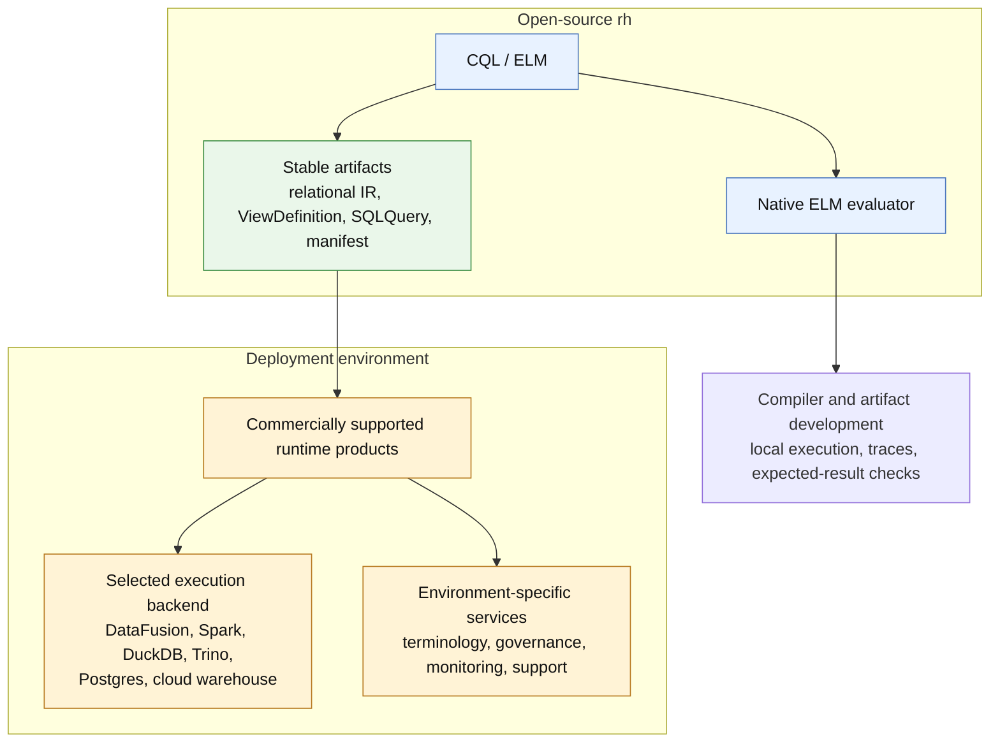
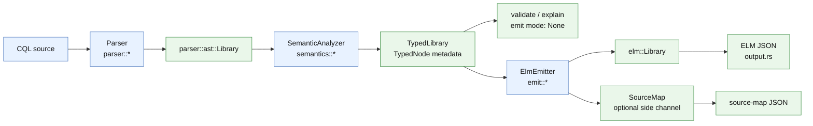
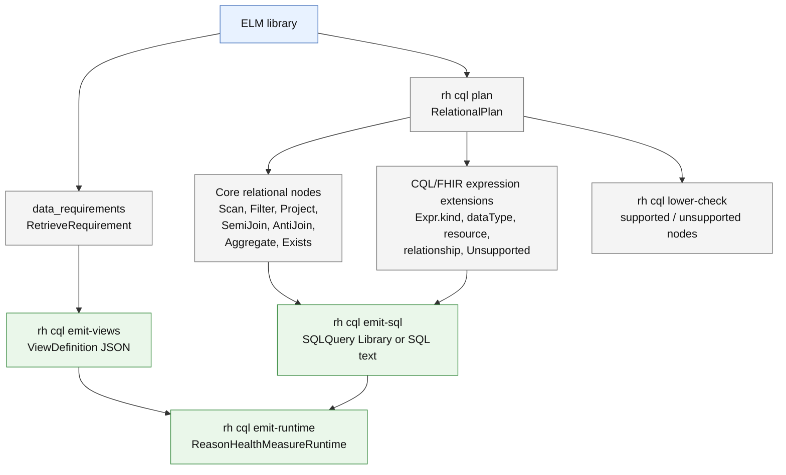

# rh-cql Architecture

This document describes the current architecture of `rh-cql`: the CQL compiler,
ELM model, evaluator, and analytics artifact tooling used by `rh`.

## Overview

`rh-cql` has two related responsibilities:

1. Compile Clinical Quality Language (CQL) source into HL7 Expression Logical
   Model (ELM).
2. Expose inspectable analysis and artifact boundaries for downstream analytics
   runtimes.

The core compiler pipeline is:

```text
CQL source
  -> parser AST
  -> semantic analysis / typed AST
  -> ELM library
  -> optional source map
```

The analytics pipeline starts from the emitted ELM library:

```text
ELM library
  -> inspection and data requirements
  -> relational algebra plan
  -> lowering support report
  -> SQL-on-FHIR ViewDefinition artifacts
  -> SQLQuery Library artifact or SQL text
  -> ReasonHealthMeasureRuntime manifest
```

`rh` owns the compiler and artifact producer boundary. Runtime execution over
FHIR data, Arrow, DataFusion, and measure comparison belongs outside this crate
in the analytics runtime.



## Motivation

`rh-cql` deliberately separates artifact development from production execution.

The native ELM evaluator exists to support compiler and artifact development.
It lets us execute CQL/ELM locally, inspect behavior, compare expected results,
debug source maps and traces, and validate that emitted artifacts preserve the
clinical intent of a CQL library. That evaluator is valuable engineering
infrastructure, but it is not the intended production analytics runtime.

The SQL and SQL-on-FHIR tooling is aimed at real-world production execution.
Production deployments need to run over large FHIR datasets, integrate with
warehouse/lakehouse/storage choices, use local governance and security models,
and tune execution for environment-specific cost and performance constraints.
Those choices are vendor- and environment-specific.

For that reason, open-source `rh` stops at stable, inspectable artifacts:

```text
CQL / ELM -> relational IR -> ViewDefinition + SQLQuery + runtime manifest
```

It does not prescribe or embed the production execution engine. Commercially
supported products can take those artifacts and provide the environment-specific
runtime: DataFusion, Spark, DuckDB, Trino, Postgres, cloud warehouses, managed
terminology services, operational monitoring, validation harnesses, and support
contracts.

This gives users a portable compiler boundary while leaving production runtime
decisions where they belong: in the deployment environment and supported
commercial product layer.



## Compiler Pipeline

All public compile entry points in `compiler.rs` delegate to a shared internal
`run_compile_pipeline` function.

```text
CQL source
  -> Stage 1: Parser
     parser/lexer.rs, parser/statement.rs, parser/expression/*
     output: parser::ast::Library
  -> Stage 2: Semantic analysis
     semantics/analyzer.rs, semantics/scope.rs, semantics/typed_ast.rs
     output: TypedLibrary + diagnostics
  -> Stage 3: ELM emission
     emit/mod.rs, emit/{clinical,conditionals,literals,operators,queries,...}
     output: elm::Library
  -> Optional source map and output serialization
     sourcemap.rs, output.rs
```

The compiler can also stop after semantic analysis for validate-only and
explain paths. That is why the shared pipeline has an explicit emit mode:
`None`, `Elm`, or `ElmWithSourceMap`.



## Current Public Surfaces

The library API exposes:

- `compile`, `compile_with_model`, `compile_with_libraries`, and
  `compile_to_json` for CQL to ELM.
- `validate` and `explain_*` paths for parser/compiler diagnostics.
- `compile_to_elm_with_sourcemap` variants for CQL source to ELM source maps.
- `evaluate_elm`, `evaluate_elm_with_libraries`, and trace-enabled evaluation.
- Analytics helper functions in `analytics.rs` for inspection, data
  requirements, relational planning, lowering reports, and artifact emission.

The CLI exposes these `rh cql` analysis and artifact commands:

```bash
rh cql compile measure.cql --output measure.elm.json
rh cql validate measure.cql
rh cql info measure.cql
rh cql explain measure.cql
rh cql elm inspect measure.elm.json
rh cql elm deps measure.elm.json
rh cql data-requirements measure.cql --format json
rh cql plan measure.cql --target relational --display-format pretty
rh cql plan measure.cql --target relational --display-format json --format json
rh cql lower-check measure.cql --target sql-on-fhir
rh cql emit-views measure.cql --out views/
rh cql emit-sql measure.cql --views views/ --out query-library.json
rh cql emit-sql measure.cql --sql-only
rh cql emit-runtime measure.cql --views views/ --query query-library.json --out measure-runtime.json
rh cql eval measure.cql "Expression Name" --data data.ndjson
```

Use global `--format json` when the command output is consumed by tools. The
CLI wraps JSON results in the standard `rh` envelope.

## Module Structure

```text
src/
├── analytics.rs          # Inspection, data requirements, relational IR, artifact emission
├── compiler.rs           # Public compiler API and shared pipeline
├── conversion.rs         # FHIRHelpers-style conversion lookup/wrapping
├── datatype.rs           # Internal semantic type model
├── elm.rs, elm/          # ELM structs and serialization model
├── emit/                 # Typed AST -> ELM emission
├── eval/                 # CQL/ELM evaluator, runtime values, operators, queries
├── explain/              # Explain helpers
├── library/              # Library source providers and compiled library management
├── modelinfo.rs          # ModelInfo model
├── modelinfo_xml/        # ModelInfo XML loading helpers
├── operators.rs          # Semantic operator resolution
├── options.rs            # Compiler options
├── output.rs             # ELM JSON output
├── parser/               # CQL parser and parser AST
├── preprocessor.rs       # Library info extraction
├── provider.rs           # ModelInfo providers
├── reporting.rs          # Diagnostics and exception reporting
├── semantics/            # Semantic analyzer, scopes, typed AST
├── sourcemap.rs          # CQL source to ELM source maps
├── types.rs              # Type resolution helpers
└── wasm.rs               # WASM-specific entry points
```

## Design Principles

### Separate Syntax, Semantics, and ELM

The parser AST preserves CQL syntax. Semantic analysis resolves names, scopes,
types, model members, operators, conversions, and diagnostics into a typed AST.
The ELM emitter consumes the typed AST and produces HL7 ELM.

This separation matters because later surfaces, such as explain, validation,
source maps, ELM emission, and analytics inspection, can share earlier pipeline
stages without coupling to one large translator.

### Typed AST Before Emission

The current architecture is not a single-pass AST-to-ELM translator. The typed
AST is an explicit compiler boundary:

```text
parser::ast::Library -> semantics::TypedLibrary -> elm::Library
```

`TypedNode<T>` carries semantic metadata such as node ids, source spans, result
types, and resolved expression structure. This makes ELM emission simpler and
keeps semantic diagnostics independent of output serialization.

### Explicit ModelInfo Boundary

Semantic analysis uses a `ModelInfoProvider`. The default provider is FHIR R4,
but callers can supply another provider through `CompilationContext` or
`compile_with_model`.

This keeps model-specific knowledge out of the parser and allows FHIR package
or custom model resolution to be swapped without changing the syntax layer.

### Serializable Artifacts

Every analytics-facing boundary is JSON-serializable:

- ELM JSON
- source-map JSON
- ELM inspection summaries
- data requirements
- relational plans
- lower-check reports
- ViewDefinition artifacts
- SQLQuery Library artifacts
- measure runtime manifests

This is intentional. These artifacts are meant to be reviewed in git, used in
fixtures, and consumed by runtimes without linking to compiler internals.

## Analytics Tooling

`analytics.rs` is the inspection and artifact layer over compiled ELM. It does
not execute analytics workloads. It turns compiler output into stable, portable
contracts intended to scale into production runtimes without requiring those
runtimes to live in open-source `rh`.

### ELM Inspection

`inspect_elm` summarizes an ELM library for humans and automation:

- library identity and version;
- using declarations and includes;
- parameters, value sets, and code systems;
- expression and function definitions;
- retrieve requirements;
- expression node counts;
- dependency information for named definitions.

The CLI surfaces this through `rh cql elm inspect` and `rh cql elm deps`.

### Data Requirements

`data_requirements` extracts the FHIR resources, retrieves, terminology
references, code systems, value sets, and parameters needed by a library.

This is the first artifact boundary used by SQL-on-FHIR emission. For example,
retrieves of `[Condition]` become requirements for a `Condition` view.

### Lowering Support Reports

`lower_check` reports whether the current first-pass relational lowerer
recognizes the ELM node kinds present in a library. It is intentionally scoped:
it is not a claim that all CQL semantics are executable as SQL.

The report separates supported and unsupported ELM node kinds, with notes about
known semantic gaps such as terminology expansion, complete interval precision,
quantity normalization, and complex list behavior.

## Relational Algebra IR

The relational algebra plan is the inspectable compiler IR between clinical CQL
semantics and backend artifacts.

```text
CQL / ELM
  -> relational algebra IR
  -> SQL-on-FHIR ViewDefinitions + SQLQuery
  -> analytics runtime execution
```

SQL-on-FHIR is an artifact target, not the core internal model. The relational
IR is the place where CQL retrieves, filters, joins, projections, aggregates,
and clinical expression predicates are normalized before choosing an output
target.



### Core Relational Algebra

The core is conventional relational algebra:

| Core node | Meaning | Typical backend mapping |
|---|---|---|
| `Scan` | Read a logical source relation | SQL table or generated ViewDefinition table |
| `Filter` | Keep rows matching a predicate | SQL `WHERE` |
| `Project` | Shape or select columns/expressions | SQL `SELECT` |
| `SemiJoin` | Keep left rows that have matching right rows | SQL `EXISTS` or semi join |
| `AntiJoin` | Keep left rows that do not have matching right rows | SQL `NOT EXISTS` or anti join |
| `Aggregate` | Group and aggregate rows | SQL `GROUP BY` |
| `Exists` | Boolean existence over an input relation | SQL `EXISTS` |

The current serialized shape is deliberately simple:

```json
{
  "op": "Filter",
  "detail": {},
  "inputs": [
    { "op": "Scan", "detail": { "resource": "Condition" } },
    { "op": "Expr", "detail": { "kind": "Equal" } }
  ]
}
```

`RelNode` is an operation name, a string detail map, and child inputs. This
keeps the first IR stable and easy to inspect while the lowerer matures.

### RH/CQL Extensions

Clinical CQL needs more than textbook relational algebra. We extend the core
with CQL/FHIR-aware details and expression placeholders:

| Extension | Why it exists |
|---|---|
| `Scan.detail.dataType` | Preserves the ELM model type such as `{http://hl7.org/fhir}Condition`. |
| `Scan.detail.resource` | Normalizes FHIR model types to runtime resource/table names such as `Condition`. |
| `Expr.kind` | Represents clinical predicate and scalar expression nodes without prematurely forcing them into SQL syntax. |
| `SemiJoin.detail.relationship` | Preserves CQL `with` relationship intent. |
| `AntiJoin.detail.relationship` | Preserves CQL `without` relationship intent. |
| `Unsupported.detail.elmType` | Makes lowering gaps explicit and testable instead of silently dropping semantics. |
| `target` on `RelationalPlan` | Names the backend vocabulary being inspected, such as `relational` or `sql-on-fhir`. |

The currently recognized expression kinds include common boolean, comparison,
terminology, timing, property, literal, and reference forms:

```text
And, Or, Not,
Equal, NotEqual, Less, LessOrEqual, Greater, GreaterOrEqual,
InValueSet, AnyInValueSet,
Overlaps, IncludedIn, Includes,
Before, After, SameOrBefore, SameOrAfter,
Property, Literal,
ValueSetRef, CodeRef, ExpressionRef, ParameterRef, AliasRef
```

These are serialized as `Expr` nodes today because the first-pass IR is focused
on making the CQL-to-relational boundary visible and reviewable. As lowering
becomes more complete, selected `Expr` nodes can be expanded into richer typed
predicate structs without changing the high-level relational core.

### Why Not Emit SQL Directly?

Direct SQL emission would tie CQL lowering to one backend too early. The
relational IR gives us:

- an inspectable debugging surface via `rh cql plan`;
- a stable fixture target for tests;
- a place to report unsupported semantics before SQL generation;
- a common source for SQL-on-FHIR, raw SQL, and future runtime-specific
  backends;
- a product boundary where open-source `rh` emits artifacts and closed-source
  analytics runtimes execute them.

### Current Limits

The current relational plan is a first-pass lowerer. It is useful for
inspection and artifact generation, but it is not a complete CQL semantic model.

Known limits include:

- incomplete terminology expansion semantics;
- incomplete interval precision handling;
- incomplete quantity and UCUM normalization;
- partial list semantics;
- no full query optimization;
- simple expression nodes rather than fully typed relational predicates.

Those limits are surfaced by `lower_check` and by `Unsupported` IR nodes.

## SQL-on-FHIR and Runtime Artifacts

The current artifact path is:

```text
rh cql emit-views
rh cql emit-sql
rh cql emit-runtime
```

### ViewDefinition Emission

`emit_view_definitions` derives deterministic SQL-on-FHIR ViewDefinition
artifacts from retrieve requirements. Each resource gets a view with stable,
runtime-friendly columns currently used by analytics fixtures:

- `getResourceKey()` as `id`;
- `subject.getReferenceKey(Patient)` as `patient_id`;
- common scalar paths when required;
- `forEachOrNull: code.coding` with `system` and `code` columns.

The generated view names and paths are deterministic so artifacts can be
checked into fixtures and reviewed.

### SQLQuery Emission

`emit_sql_text` and `emit_sql_query_library` generate:

- raw SQL text for inspection and backend experiments;
- a FHIR `Library` artifact containing SQLQuery metadata;
- `relatedArtifact` dependencies on emitted ViewDefinitions;
- parameter metadata derived from CQL parameters;
- SQL text in the SQL-on-FHIR extension plus base64 attachment data.

The initial SQL generator is intentionally conservative and retrieve-oriented.
More complete relational lowering should happen through the relational IR
rather than by adding ad hoc SQL generation directly from ELM.

The emitted SQL artifacts are designed as execution contracts, not as a claim
that `rh` itself is the production execution engine. The same artifacts can be
run by commercial or local products that choose an appropriate backend for the
deployment environment.

### Measure Runtime Manifest

`emit_measure_runtime_manifest` writes the first ReasonHealth runtime manifest:

```json
{
  "resourceType": "ReasonHealthMeasureRuntime",
  "id": "examplemeasure",
  "measure": "ExampleMeasure",
  "query": "query-library.json",
  "views": ["views/condition_view.json"],
  "parameters": [
    {
      "name": "condition_code",
      "type": "string",
      "required": false
    }
  ],
  "results": [
    {
      "name": "initialPopulation",
      "kind": "population",
      "source": "query",
      "column": "patient_id"
    }
  ]
}
```

The manifest is path-oriented and JSON-serializable. It intentionally references
artifacts instead of embedding compiler internals. Runtime consumers can load
the manifest, load the referenced views and query, bind parameters, and collect
named result populations.

The CLI accepts `--result name=column` to map result names to query result
columns. If omitted, it defaults to `initialPopulation=patient_id`.

## Evaluation Engine

The `eval/` module provides an optional CQL/ELM runtime used for local
artifact-development, debugging, and comparison workflows. It includes:

- CQL runtime `Value` types;
- three-valued logic helpers;
- arithmetic, comparison, string, temporal, conversion, interval, list, and
  query operators;
- `EvalContext` and data/terminology provider traits;
- trace-enabled evaluation for debugging.

The evaluator is separate from analytics artifact execution. The evaluator
executes CQL/ELM semantics directly so compiler authors and artifact developers
can test behavior without a warehouse or commercial runtime. Production
analytics runtimes execute emitted relational artifacts over projected FHIR
tables and are expected to make environment-specific backend choices outside
this crate.

## Error Handling and Diagnostics

Diagnostics flow through `reporting.rs` and carry stage, severity, source
location, and structured details where available. The compiler collects
multiple diagnostics when possible instead of stopping at the first recoverable
problem.

Important diagnostic boundaries:

- parser errors from `parser/`;
- semantic/type/operator errors from `semantics/`, `types.rs`, and
  `operators.rs`;
- emitted diagnostics exposed by `compile`, `validate`, and CLI JSON envelopes;
- lowerability diagnostics exposed separately by `lower_check`.

## Extension Points

### Adding CQL Syntax

1. Add parser AST support in `parser/ast.rs` and parser modules.
2. Add semantic analysis and type resolution in `semantics/`, `types.rs`, and
   `operators.rs`.
3. Add ELM emission in `emit/`.
4. Add evaluator support if runtime evaluation is expected.
5. Add analytics lowering support if the construct should participate in
   relational artifact emission.

### Adding Relational IR Support

1. Teach `plan_expression` or `plan_query` how to lower the ELM shape.
2. Preserve CQL/FHIR-specific information in `detail` or a richer serializable
   node shape.
3. Update `is_supported_for_first_pass` so `lower_check` reflects the new
   support.
4. Add formatted and JSON fixture coverage for `rh cql plan`.
5. Add SQL-on-FHIR or SQLQuery emission only after the IR representation is
   reviewable.

### Adding Artifact Targets

New targets should consume the relational IR or data requirements rather than
re-walking CQL source directly. This keeps the compiler boundary stable:

```text
CQL -> ELM -> relational IR -> artifact target
```

## Future Work

Near-term work should focus on:

1. Expanding relational expression nodes beyond `Expr.kind` placeholders.
2. Lowering more CQL query relationships, projections, and population
   operations.
3. Improving terminology and value-set handling at the artifact boundary.
4. Emitting richer measure runtime manifests for multiple populations directly
   from CQL measure structure.
5. Keeping `lower_check` precise as support broadens.

Longer-term work can add optimization, backend-specific planning, richer source
maps across analytics artifacts, and more complete fallback coordination between
relational execution and direct CQL evaluation.
